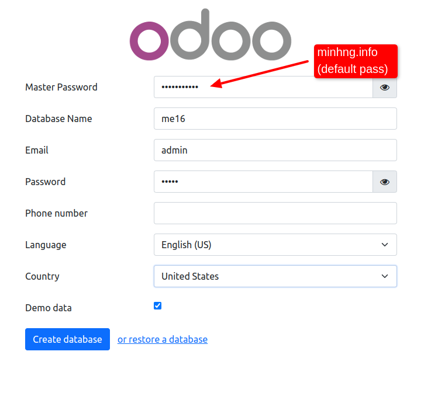
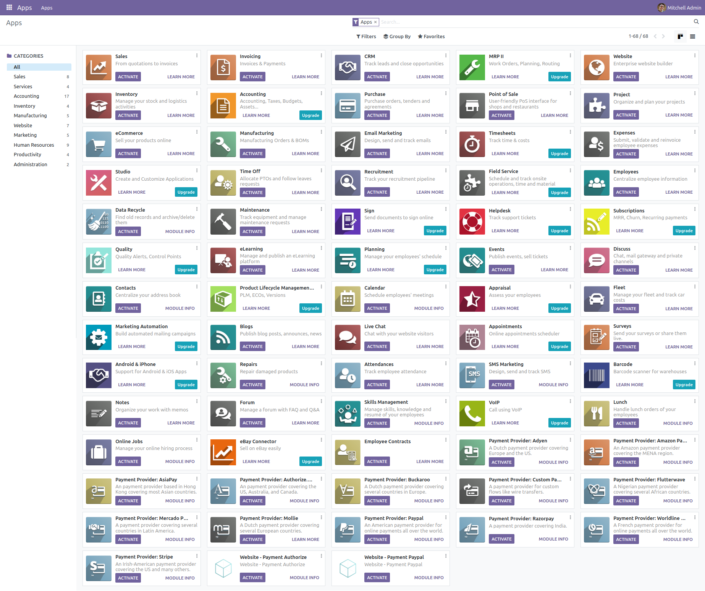
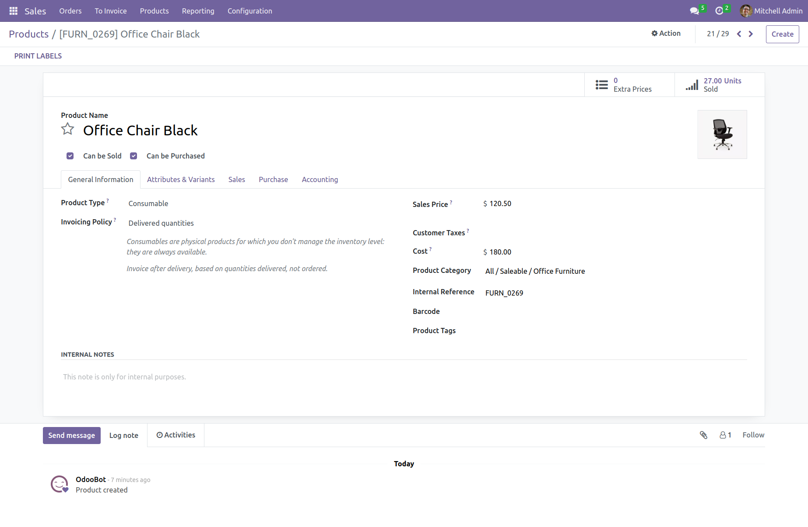

#odoo

### Installazione di Odoo 16.0 con un comando (supporta più istanze di Odoo su un server).


## Prerequisiti

- Installa docker e componi te stesso
- Docker Compose installato sul computer host

## Utilizzo

1. Assicurati che Docker e Docker Compose siano installati sul tuo sistema.

2. Avviare il contenitore:

```bash
   docker-compose-up
```
Ciò avvierà i contenitori Odoo e PostgreSQL in background.

Puoi accedere all'interfaccia di Odoo aprendo un browser web e visitando http://localhost:80.

3. Per arrestare i contenitori, eseguire:
 
 ```bash
  docker-compose down
```

  # Impostare

Questo file "docker-compose.yml" definisce la configurazione dei servizi Docker utilizzati per eseguire Odoo e PostgreSQL in un ambiente containerizzato.

## Servizio "Web" (Odoo)

- Immagine utilizzata: `odoo:16.0`
- Porte esposte: `80:8069` (interfaccia Odoo accessibile dalla porta 80 del browser)
- Dipendenze: il servizio "db" (PostgreSQL)
- Volumi montati:
  - `odoo-web-data`: dati persistenti per Odoo
  - `./config`: file di configurazione di Odoo
  - `./addons`: componenti aggiuntivi personalizzati per Odoo
- Rete: "odoo_network".

## Servizio "db" (PostgreSQL)

- Immagine utilizzata: `postgres:15`
- Variabili ambientali:
  - `POSTGRES_DB`: database PostgreSQL
  - `POSTGRES_PASSWORD`: password del database
  - `POSTGRES_USER`: utente PostgreSQL
  - `PGDATA`: posizione dei dati PostgreSQL
- Volumi montati: `odoo-db-data` (dati persistenti per PostgreSQL)
- Rete: "odoo_network".

## Volumi e Rete

Questo progetto utilizza i volumi Docker per archiviare i dati in modo persistente, insieme a una rete personalizzata per connettere i contenitori.

### Volumi:

- `odoo-web-data`: dati persistenti per Odoo
- `odoo-db-data`: dati persistenti per PostgreSQL

### Rete :

- `odoo_network`: rete personalizzata per connettere contenitori Odoo e PostgreSQL


## docker-compose.yml

*odoo:16.0
* postgre:15

## Schermate di Odoo 16.0 dopo l'installazione riuscita.







